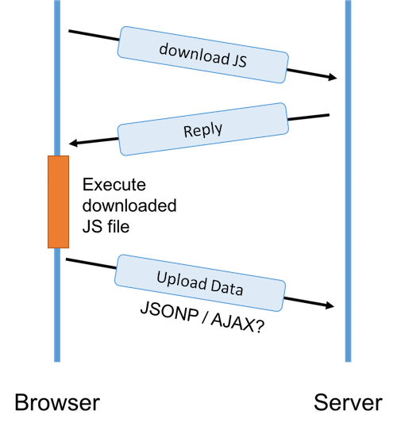

# JSONP & CORS Lab

In this lab, we are going to experience how one can write a script similar to Google Analytics.

An example system is up and can be download in the following link:
[https://github.com/tywong/csci4140-analytics](https://github.com/tywong/csci4140-analytics).

## Analytics script's workflow



1. When you need to the analytics service, you will subscribe to it and then you will get a piece of code, such as the following example from the Google Analytics service:

	```
	<script>
	  (function(i,s,o,g,r,a,m){i['GoogleAnalyticsObject']=r;i[r]=i[r]||function(){
	  (i[r].q=i[r].q||[]).push(arguments)},i[r].l=1*new Date();a=s.createElement(o),
	  m=s.getElementsByTagName(o)[0];a.async=1;a.src=g;m.parentNode.insertBefore(a,m)
	  })(window,document,'script','https://www.google-analytics.com/analytics.js','ga');

	  ga('create', 'UA-xxxxxxxxx-1', 'auto');
	  ga('send', 'pageview');

	</script>
	```