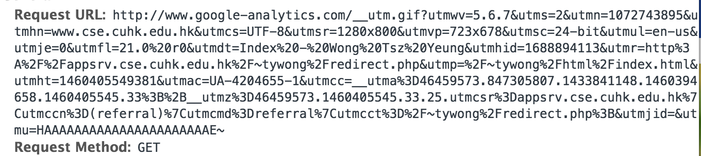

# JSONP & CORS Lab

In this lab, we are going to experience how one can write a script similar to Google Analytics (GA).

An example system is up and can be download in the following link:
[https://github.com/tywong/csci4140-analytics](https://github.com/tywong/csci4140-analytics).

## Analytics script's workflow


1. When you need to the analytics service, you will subscribe to it and then you will get a piece of code, such as the following example from the Google Analytics service:

	```
	<script>
	  (function(i,s,o,g,r,a,m){i['GoogleAnalyticsObject']=r;i[r]=i[r]||function(){
	  (i[r].q=i[r].q||[]).push(arguments)},i[r].l=1*new Date();a=s.createElement(o),
	  m=s.getElementsByTagName(o)[0];a.async=1;a.src=g;m.parentNode.insertBefore(a,m)
	  })(window,document,'script','https://www.google-analytics.com/analytics.js','ga');

	  ga('create', 'UA-xxxxxxxxx-1', 'auto');
	  ga('send', 'pageview');

	</script>
	```

2. Running such a code will trigger the download of the file `analytics.js` from Google server.

3. Next, the analytics script executes.

4. Last, such a script triggers an upload event so as to upload the tracking information to Google server.

## Point of focus: how to upload?

To upload such information, there are two choices:

1. **JSONP**. The URL for the JSONP requst already embeds information required by the tracking script. E.g., the following figure is the resulting request seen by the Developer Tool of Google Chrome visiting a GA script-enabled site:

	

	The only disadvantage is that the URL with the query parameter has a length limit imposed on the server side. The server which accepts such data must be able to handle a long list of parameters.

2. **AJAX**. With a AJAX, we can choose to use the POST method so as to solve the server-side URL length limit problem. Yet:

	- The tracking script may be used by any sites in the Internet.
	- Then, SOP disallows us to send AJAX request to a different hosts. E.g., if CUHK is using GA service, then the upload of the tracking information has to be done by JSONP due to the SOP restriction.

Fortunately, on the server side, we can implement **CORS - cross origin resource sharing**. By adding the following header in the HTTP response message:

```
Access-Control-Allow-Origin: *
```

The client can use POST method with AJAX to upload data!

---
[Dr. WONG Tsz Yeung](http://www.cse.cuhk.edu.hk/~tywong)