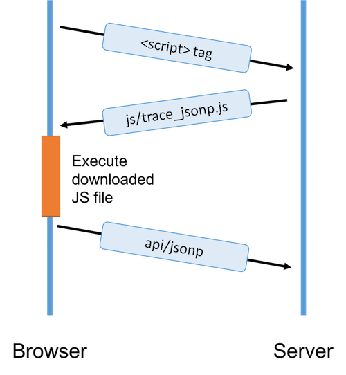

# Task 0 - Project Setup

In this lab, we will be writing Heroku application in Node.JS and Express.JS. Such a project is to provide a server space in order to implement the following flow:



1. Install the **express-generator**: `npm install -g express-generator`

2. Create a new express project, we may call that `4140-analytics`.

	```
	express 4140-analytics
	```


3. Initialize and commit that folder as a git repository:

	```
	cd 4140-analytics
	echo "node_modules" > .gitignore
	npm install
	git init
	git add --all
	git commit -m "first commit"
	```

	Whether you want a remote repo on Github or not is up to you.

4. Install the **Heroku toolbelt** if you don't have it:

	[Heroku tutorial on deploying Node.JS application](https://devcenter.heroku.com/articles/getting-started-with-nodejs#set-up)


	Then, log in using `heroku login`

5. Initialize the repo as a Heroku project repo:

	```
	heroku create
	```

6. Create the `Procfile` with the following content

	```
	PORT=5000
	```

7. Test run your Express JS project:

	- **Local trial**. First, type:

		```
		heroku local
		```

		Then, visit the URL [http://127.0.0.1:5000](http://127.0.0.1:5000).

	- **Remote execution**. First, type:

		```
		git push heroku master
		```

		Then, type:

		```
		heroku open
		```

	On both trials, you will see the sentences `Express` and `Welcome to Express`.

---
[Dr. WONG Tsz Yeung](http://www.cse.cuhk.edu.hk/~tywong)