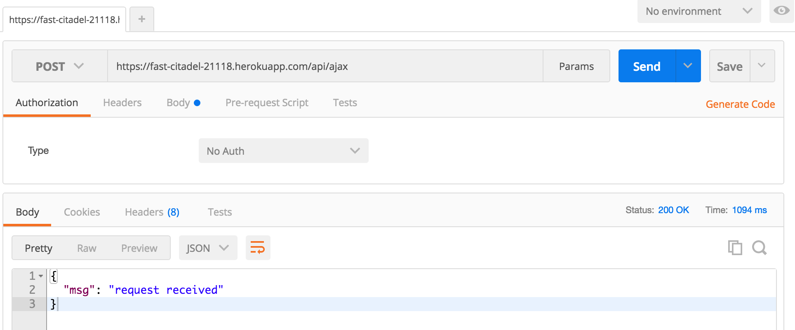

# New API Router

We are going to set up a router so that there are at least two services:

1. The JSONP Service: [http://your-project.herokuapp.com/api/jsonp](http://your-project.herokuapp.com/api/jsonp)

	- It accepts HTTP requests using the **GET method** only;
	- Input argument becomes a query string in the URL;

2. The AJAX Service: [http://your-project.herokuapp.com/api/ajax](http://your-project.herokuapp.com/api/ajax)

	- It accepts HTTP requests using the **POST method** only;
	- Input argument becomes a query string in the request payload;


## Adding the new router

1. In the home directory of the project, locate the file `app.js` and modify it as follows:

	- Add the new `require` statement:

		```javascript
		var routes = require('./routes/index');

		## Add one new line ##
		var api = require('./routes/api');
		```

	- Add the router to the express middleware:

		```javascript
		app.use('/', routes);

		## Add one new line ##
		app.use('/api', api);
		```

2. In the `routes` directory, let us create a new file called `api.js`. Note that the __name is important__ because it has to be the same as the added `require` statement.

3. Let us edit the file `api.js`:

	```javascript
	var express = require('express');
	var router = express.Router();

	router.route('/jsonp').get(function(req, res) {
		console.log("request received");
		res.send("console.log('request received');");
	});

	router.route('/ajax').post(function(req, res) {
		res.send({msg: 'request received'});
	});

	module.exports = router;
	```

4. Let us push the new code to Heroku:

	```
	cd ..         ## go back to the home of the application
	git add --all 
	git commit -m "Added a new router: api"
	git push heroku master
	heroku open
	```

5. Test the JSONP link with GET method. How?  Just open the following link in your browser: `http://your-project.herokuapp.com/api/jsonp`

6. Test the AJAX link with POST method. How?

	- Install [Postman, a Chrome Extension](https://chrome.google.com/webstore/detail/postman/fhbjgbiflinjbdggehcddcbncdddomop?hl=en)

	- Laucnh Postman on your computer.

	- Visit the link `http://your-project.herokuapp.com/api/ajax` using the POST method. If you do not know how, please refer to the image below:

	
