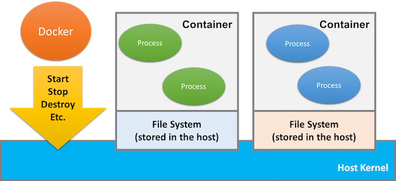

# Docker Lab for CSCI 4140

- Did you install Docker Toolbox? It can be found in the link: [https://github.com/docker/toolbox/releases](https://github.com/docker/toolbox/releases).

- Did you create you Docker Hub account? Please visit the following link and create your account: [https://hub.docker.com/](https://hub.docker.com/)

- Good!  Let's read some boring introduction first:

## What is docker or Linux container?

Virtual Machine Environment | Use Docker
--------------------------- | ----------
 |  |
Under the VM setting, every VM is a full OS. | Under the Docker setting, every container is an isolated environment with shared kernel. |


- How do we know that the kernel is shared under a Docker environment? Let us take a look at the following pair of command outputs. Basically, I run the same command `uname -a` on two different Linux containers.

  1. Running in the container of Ubuntu 12.04.
  ```
  $ docker run -it --rm ubuntu:12.04 uname -a
  Linux 154ec37d8e6c 4.1.13-boot2docker #1 SMP Fri Nov 20 19:05:50 UTC 2015 x86_64 x86_64 x86_64 GNU/Linux
  $ _
  ```
  2. Running the Docker image of Ubuntu 14.04
  ```
  $ docker run -it --rm ubuntu:latest uname -a
  Linux 154ec37d8e6c 4.1.13-boot2docker #1 SMP Fri Nov 20 19:05:50 UTC 2015 x86_64 x86_64 x86_64 GNU/Linux
  $ _
  ```

  See? Both commands returns the same result!

## Docker is Linux!

You know, Docker is just a daemon / server that controls a set of Linux containers.



Once you type docker commands, the docker daemon translates them into [LXC commands](https://linuxcontainers.org/lxc/introduction)

> Dr. WONG and his FYP team had been used LXC commands since 2013 summer. But, well, Docker become popular since 2013 Fall :(

## How about Mac OS X and Windows?

Clearly, Docker is a set of Linux commands and those Linux commands talk to the Linux kernel. Does it mean that Mac OS X and Windows do not have the chance to use Docker?

[!Docker in Mac](images/docker-mac.png)

In Mac OS X and Windows, the docker tool is sending commands to another docker daemon running inside VirtualBox. Therefore, Mac OS X and Windows are development environments; they are not perfect deployment / production environments using Docker.

## Vocabulary
 Docker Vocabulary | Meaning
 ----------------- | -------
Container | The Linux container, which is a process to the host Linux.
Docker image | The file system for the container, which is a set of folders to the host Linux
Docker Hub | A public repository for docker images
Docker pull | Download docker images
Docker push | Upload docker images
Docker run | Start a linux container
Boot2docker | The outdate name for the Linux VM running on Virtualbox
docker-machine | The latest name for the Linux VM running on Virtualbox

We cannot cover everything here since most of the vocabulary is related to the commands and the executions of containers.

---
By [Dr. WONG Tsz Yeung](http://www.cse.cuhk.edu.hk/~tywong)
