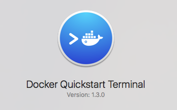

# Task 1: Start Your First Docker

## Step 0. Launch the Docker VM

This step is for non-Linux hosts.

- First, you have to launch the Linux VM. Run **Docker QuickStart Terminal**.

  

- Next, you can use the terminal created for you in using docker.

- In case that you want to create another terminal in controlling docker, please type the following command:

  ```
  eval $(docker-machine env default)
  ```

  - `docker-machine` is the command that controls the docker Linux VM.
  - The argument `env` means reading the environment for connecting to the Linux VM.
  - That Linux VM is called `default`

- To test if your environment is fine, type:

  ```
  $docker version
  ```

  If you **did not set up the environment**, we will have the following:
  ```
  Client:
   Version:      1.9.1
   API version:  1.21
   Go version:   go1.4.3
   Git commit:   a34a1d5
   Built:        Fri Nov 20 17:56:04 UTC 2015
   OS/Arch:      darwin/amd64
  Cannot connect to the Docker daemon. Is the docker daemon running on this host?    
  ```

  Else, if you set up the environment, we will get:
  ```
  Client:
   Version:      1.9.1
   API version:  1.21
   Go version:   go1.4.3
   Git commit:   a34a1d5
   Built:        Fri Nov 20 17:56:04 UTC 2015
   OS/Arch:      darwin/amd64

  Server:
   Version:      1.9.1
   API version:  1.21
   Go version:   go1.4.3
   Git commit:   a34a1d5
   Built:        Fri Nov 20 17:56:04 UTC 2015
   OS/Arch:      linux/amd64
  ```

## Step 1. Add Your Docker Hub Credential

- Type the command:
  ```
  docker login
  ```
- Then, log in with your Docker Hub credential.

- This is for pushing and pulling your own images later.


## Step 2. Pull an Existing Docker Image

Let us start with the Ubuntu Image: [https://hub.docker.com/_/ubuntu/](https://hub.docker.com/_/ubuntu/)

- To pull the image to your VM:
  ```
  docker pull ubuntu
  ```
  By default, the **latest** version of the docker image will be pulled. Of course, you can choose different versions as you wish to:

  E.g., the last Ubuntu TLS:
  ```
  docker pull ubuntu:12.04
  ```

- After the pull has finished, you can verify the result using the command:
  ```
  $ docker images
  REPOSITORY          TAG                 IMAGE ID            CREATED             VIRTUAL SIZE
  ubuntu              latest              6cc0fc2a5ee3        5 days ago          187.9 MB
  ubuntu              12.04               6b4adea2c00e        5 days ago          137.5 MB
  $ _
  ```

- Of course, we need the latest Ubuntu only.

## Step 3. Try entering the container

To go into the container, it means:

1. We run the command `/bin/bash` inside the container.
2. The command is:
  ```
  docker run -i -t ubuntu /bin/bash
  ```
    - `-i` means *interactive* using STDIN.
    - `-t` means *allocate* a terminal for you.

3. The outcome is an interactive shell like the following:
  ```
  root@0182501a921d:/# uname -a
  Linux 0182501a921d 4.1.13-boot2docker #1 ... x86_64 GNU/Linux
  ```
  Type `uname -a` so that you can confirm that you are inside a Linux container.

4. To leave this shell, you can type `exit` or `Ctrl + D`.

---
By [Dr. WONG Tsz Yeung](http://www.cse.cuhk.edu.hk/~tywong)
