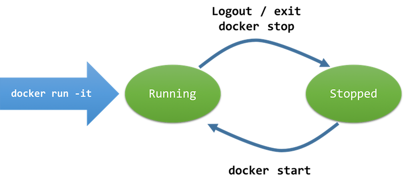

# Task 2: Docker Lifecycle Under Interactive Sessions



## Command List

Commands | Descriptions
-------- | ------------
`docker run -it ubuntu /bin/bash` | Start a container with an interactive shell.
Exit the shell | The container is stopped.
`docker ps -a ` | To inspect the container ID of stopped containers.
`docker start [Container ID]` | To start the stopped container. Yet, you are not attached to the interactive shell.
`docker attach [Container ID]` | You are attaching to the interactive shell of the running container.
`docker rm [Container ID]` | Permanently remove the stopped container.
`docker rm -f [Container ID]` | Permanently remove a container even though it is running.
`docker run -it --rm ubuntu /bin/bash` | Start a container and it will be removed when you stop it.

## Your Try

Let us try out the above commands one by one!

1. Run `docker run -it ubuntu /bin/bash`.

2. Inside the shell, use Vi / file redirection to create a file called **abc.txt** (or whatever name) in the root directory.

3. Leave the shell by typing `exit` or `Ctrl + D`.

4. What can you see from `docker ps -a`?. If there are more than one entry, locate the latest entry. E.g.,
```
CONTAINER ID        IMAGE               COMMAND                  CREATED             STATUS
a349adb94784        ubuntu              "/bin/bash"              15 seconds ago      Exited (0) 2 seconds ago
```
Notice that the **first column of the output is the container ID**.

5. Let us restart that container using `docker start [CONTAINER ID]`. Right! It is the first column of the report from `docker ps -a`.

6. Run `docker ps -a` again. What is the status of your container?

7. Let us re-attach to the interactive shell of that container: `docker attach [Container ID]`.
> You may need to press `Enter` for a few times.

8. Now, can you find **/abc.txt**? If not, that means you can connect to the wrong container.

9. Let's quit the shell. Let us terminate the container permanently: `docker rm [Container ID]`.
> Of course, you can remove all other stopped using `docker rm`

10. Last, let's try the command `docker run -it --rm ubuntu /bin/bash`.
  - Can you find **/abc.txt** this time?
  - Exit the shell.
  - Type `docker ps -a` again.
  - Can you find the stopped container?
> `--rm` in the docker run command means removing the container when it stops.

## Isolated File Systems


With the creation of the file `/abc.txt`, you can observe that **different containers have different disks**. Though the containers may be coming from the same image, the file systems are separated.

- Containers preserve the file system before it stops.
- New containers always start with the master copy / base image.
- File systems of removed containers are completely destroyed and would not affect the base image.

---
By [Dr. WONG Tsz Yeung](http://www.cse.cuhk.edu.hk/~tywong)
