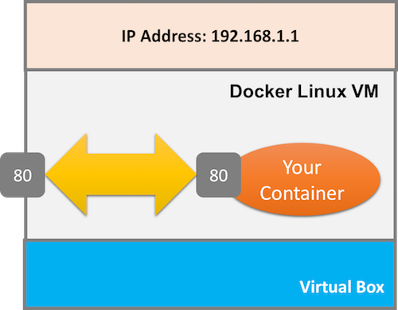
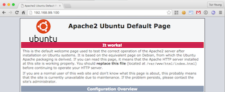

# Launch Container in Daemon Mode

We start using Docker in a proper way now!
> What? Going through so many commands and you tell me now is the main course?

## Step-by-Step Walkthrough

1. We start the apache server as a daemon.
  ```
  docker run -d -p 80:80 [Your Create Image] apache2ctl -DFOREGROUND
  ```
  - Now, your docker is running your apache server as a daemon.

  - Let's check this out using `docker ps -a`:
    ```
    CONTAINER ID    IMAGE               COMMAND                 ...  PORTS              
    cfb23fa64fe8    tywong/web-server   "apache2ctl -DFOREGRO"  ...  0.0.0.0:80->80/tcp   
    ```

  - In this time, we find something new: `0.0.0.0:80->80/tcp`.

  - That means the Linux VM's port 80 will forward traffic to the Container's port 80.

  

2. In the figure, we use the IP address `192.168.1.1`. You may wonder what it is in the real situation.
  - Please type `docker-machine ip default`
  - The result is IP address of the Linux VM.
  - Last, use your browser to visit that IP address.
  - If you're using <u>native Linux</u>, you don't need the above three steps. Just visit `127.0.0.1` using your browser.

3. In your browser, you should see something like the following:

  

Next, we will customize the web server image.
