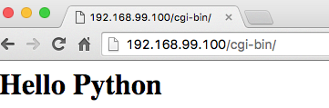
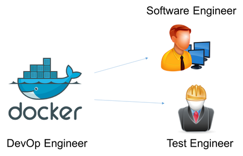

# Customizing Your Web Server Container

Your web server needs more configurations. Before you customize your image, we should better shut down the apache container:
```
docker rm -f [CONTAINER ID]
```
 - The option `-f` means *force* the removal even though it is running.

Then, we will start the VM in the interactive session in order to customize it.
```
docker run -it --name seed tywong/web-server /bin/bash
```
  - The option `--name seed` means giving the container the name `seed`. You can name it to whatever name your want. The name is a good way to simplify our task instead of inspecting `docker ps -a` again and again.

## CGI support

1. Go to the directory `/etc/apache2/sites-available/`;

2. Edit the file `000-default.conf`;

3. Before `</VirtualHost>`, add the following

```
ScriptAlias /cgi-bin/ /var/www/html/cgi-bin/
<Directory "/var/www/html/cgi-bin/">
  Options +ExecCGI
  AddHandler cgi-script .cgi .pl
  Options FollowSymLinks
  Require all granted
</Directory>
```
4. Save the modified file.

5. Run `a2enmod cgi`

6. Go to the directory `/var/www/html/`.

7. Type `mkdir cgi-bin`. Then, `cd cgi-bin`.

8. Write the following python program with the name `index.cgi`:
  ```
  #!/usr/bin/env python

  print "Content-type: text/html\n\n"

  print "<h1>Hello Python</h1>"
  ```

9. Type: `chmod 755 index.cgi`.

10. Then, test run the program `./index.cgi`. In case that `python` is not installed, run `apt-get install -y python`.

11. Then, you can leave the interactive shell.

12. Commit the container using the following command:
  ```
  docker commit -m "Added CGI support" -a "[Your Name]" seed [Your Image Name]
  ```
  E.g.
  ```
  docker commit -m "Added CGI support" -a "tywong" seed tywong/web-server
  ```

13. Last but not least, test time!
  ```
  docker run -d --name test -p 80:80 [Your Create Image] apache2ctl -DFOREGROUND
  ```
  Note that `--name test` is to set up a name called **test** for the testing container.

14. To test if the container is up, use your browser to visit the web server. E.g., `http://192.168.99.100/`

15. To test if the CGI support is successfully done, visit the URL with the postfix `cgi-bin`. You should be able to see the following:

  

---

## Lots of Stress and now what?

As a matter of fact, the docker image that I created can be shared to YOU! I am taking up a role called the **DevOp engineer**.



The DevOp engineer prepares the development / testing environment for the whole team so that everyone will be working on a unified environment!
