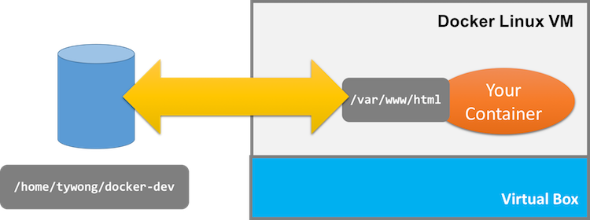
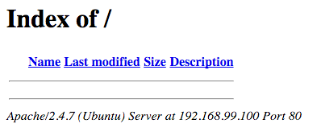

# Creating a Development Folder for the Web Server Container

You know, if you are going to change web server container, we have to
  1. change the seed container;
  2. commit the seed container as an image;
  3. see the change by launching a new testing container.

The workflow is not intelligent at all! Don't worry. Docker has an intelligent way!

## Mounting a volume

1. Go to your home directory, e.g., `/home/tywong`.  Create a sub-directory called `docker-dev`, meaning *"docker development"*.

2. Make sure that you have terminated the previous `test` container: `docker rm -f test`.

3. Next, we create a new container that will mount `/home/tywong/docker-dev` to the container as follows.

```
docker run -d --name test -p 80:80 -v /home/tywong/docker-dev:/var/www/html tywong/web-server apache2ctl -DFOREGROUND
```

Note that the option `-v /home/tywong/docker-dev:/var/www/html` replaces the content in `/var/www/html` inside the docker with the content in `/home/tywong/docker-dev` in the host system.



4. To test if the container is up, use your browser to visit the web server. E.g., `http://192.168.99.100/`. You should find the following:



5. Then, go inside the folder `/home/tywong/docker-dev`, and create the the file `index.html` with the following content:
```
<h1>It works</h1>
```

Reload the browser and you should find the big message **It works!**.

6. Inside `/home/tywong/docker-dev`, create the directory `cgi-bin`.

7. Go to `/home/tywong/docker-dev/cgi-bin`. Create the file `index.cgi` with the following content:
```
#!/usr/bin/env python

print "Content-type: text/html\n\n"

print "<h1>Hello Python</h1>"
```

8. Visit the `cgi-bin` folder with the following example link: `http://192.168.99.100/cgi-bin`, and you should find the big message **Hello Pyton**.

---

Cool!  This is the end of the today's lab. The tutorial will cover more :)
