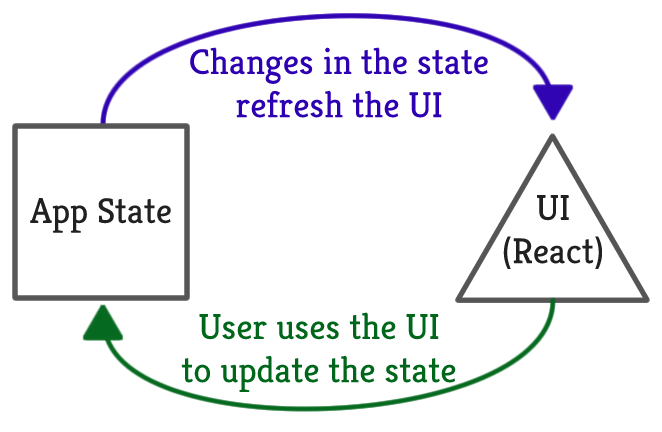

# React JS Lab for CSCI 4140

What is so good about React JS?  It is a design that separates the state of the application from the UI components.

The following image best describes such a key feature:

In this lab, you will go through steps in transforming an HTML page into an React JS application. Our target is to write a web-based Othello game, which is already implemented in [our course repo](https://github.com/tywong/cuhk-csci4140/tree/master/react-othello).

1. Given a HTML page representing the game layout, we identify and decompose it into small components. We will also identify what the game state is.

2. For each component, we package it into a *React Component*. At the same time, we will introduce the JSX codes used by React JS.

3. Next, we hard code the game state so as to see if the correct game layout is displayed accordingly.

4. Last, we introduce the change of the game state.

5. By the way, we did not talk about the game logic. Well, it depends on the time in the lab. Probably, we will skip the implementation of the game logic.
