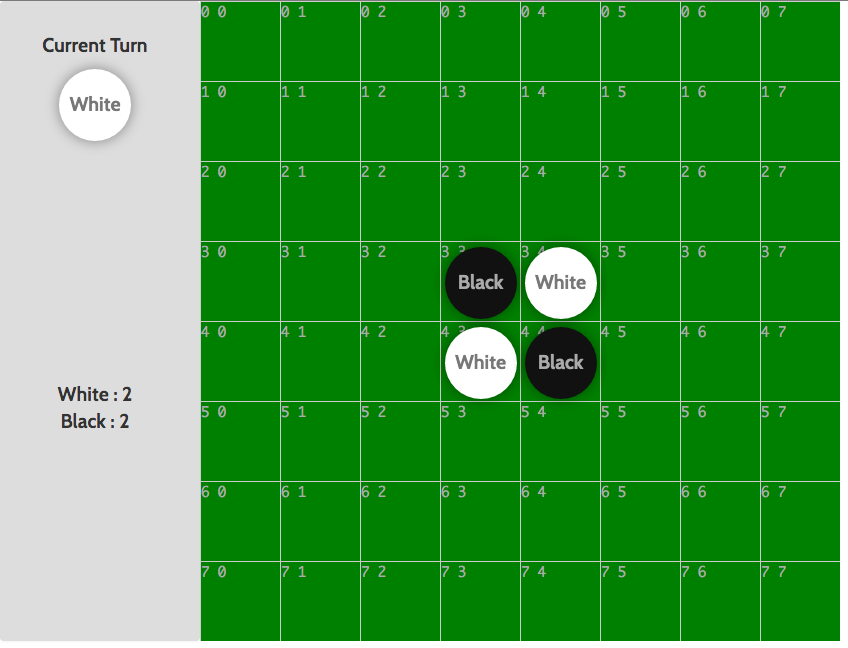

# Set Up a Node JS Development Environment

Writing React JS application is done in the Node JS environment. Therefore, you have to install Node JS. How? I recommend the use of Docker!  

## Basic Setup

In case you have any docker image available, please start a container with that image:

- Suppose that you have a directory `/home/tywong/nodejs-dev` in the host file system
- Then, run the following:
  ```
  docker run -it --name nodejs -p 3000:3000 -v /home/tywong/nodejs-dev:/nodejs-dev tywong/your-image-name /bin/bash
  ```
- Suppose that you are using a Ubuntu-based image, please run the following:

  ```
  apt-get update
  apt-get install curl git
  ```

- Now, we are going to install Node JS by following the [official Node JS instruction guide](https://github.com/nodejs/node-v0.x-archive/wiki/installing-node.js-via-package-manager)

  ```
  curl -sL https://deb.nodesource.com/setup_5.x | sudo -E bash -
  sudo apt-get install --yes nodejs
  ```

- Last, test whether Node JS is installed in your container properly or not:

  ```
  node -v   ## should print: v5.8.0
  ```

## Try compiling a sample React JS project

We have a sample React JS project implemented: it is the [Othello game](https://github.com/tywong/cuhk-csci4140/tree/master/react-othello). Please follow the instructions stated in the README.md of that repo in order to compile and to run the project.

You should be able to see the following screen and can play on the game interface!


