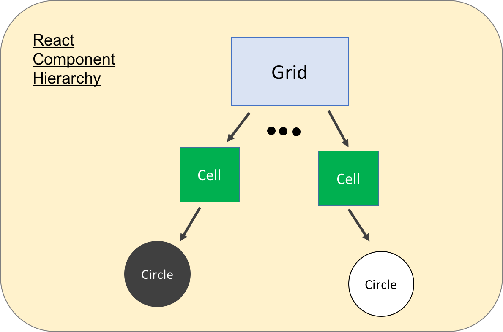

# Mapping a HTML Layout into a React Component Tree

You know, we are going to implement the Othello game using React JS. Let's do a warmup exercise! We need to construct the game board using HTML first.

Don't worry if you think that were a demanding task; I have the [html code](index.html) ready for you to use.

## HTML Code Layout

How does that HTML look like?  The HTML code itself is a self-contained code without any external dependencies (or files). You can open it directly on your browser.

```
BODY
  |
  |
  +-> div (game main div)
        |
        |
        +-> div * 64 (the green cell)
             |
             +-> Possibility (1): empty
             |
             +-> Possibility (2): div (a white circle drawn by CSS)
             |
             +-> Possibility (3): div (a black circle drawn by CSS)
```

As you can see, the entire game is drawn by a tree of nested div layers!

## React JS Component

When it comes to React JS, you have to **think from another direction**.

- A React JS application is constructed by a tree of components.
- For each component, it should its internal state.
- The *appearance* of a component will be rendered when:
  - when the component is "*loaded*" for the first time, or
  - when the internal state of that component is updated.

That's why I said that "*you have to think from another direction*". A React JS component can be something not related to any HTML codes!

The following figure shows how one can break the game into components. It is very much like a fine-grain OO design project :)



## Game / Component state

In the Othello game, what do you think the game state should contain?

Don't worry if you cannot think of the answer, we won't code that. But, you have to train yourself in identifying <u>items / data / memory compose the state of the game</u>.

  - Color of the cell should not be the state; it is only a property of the UI.
  - The current player is the game state!  It determines which disc to put onto the grid.
  - The 2D abstraction of the game board is also the game state!  It determines the current progress of the game. Most important of all, **when the game board updates, the UI has to be updated as well.**

Okay. Let's have our first React component: the circle (or the disc).

---
By [Dr. WONG Tsz Yeung](http://www.cse.cuhk.edu.hk/~tywong)
